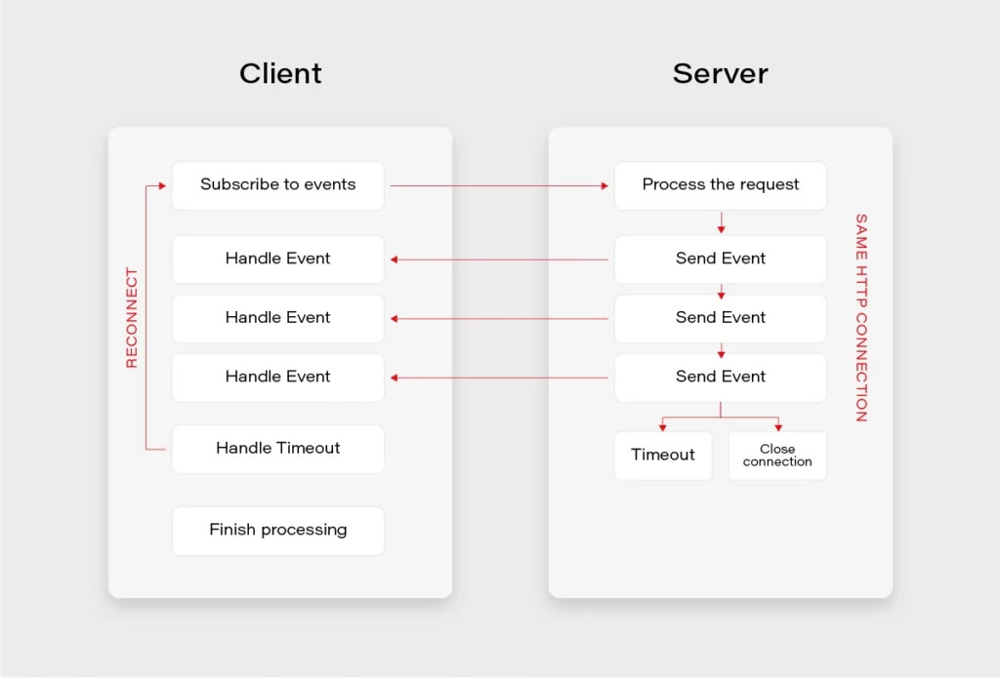
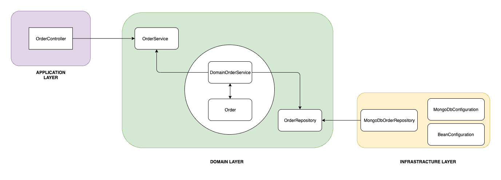
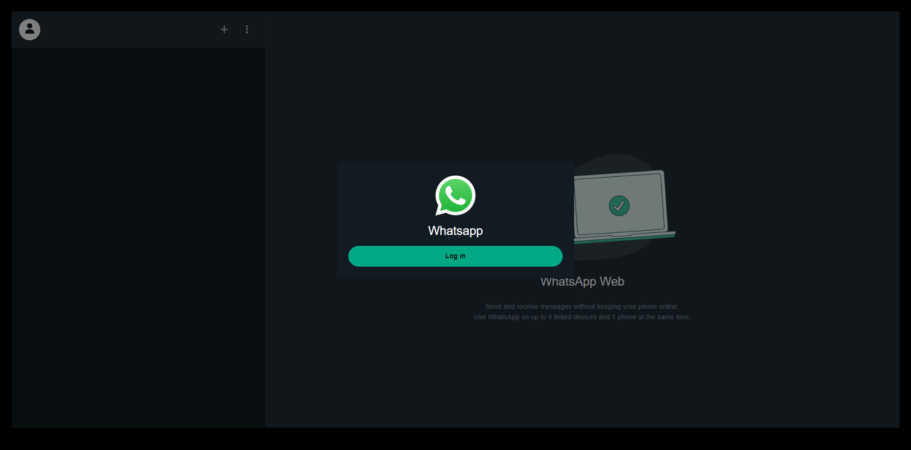
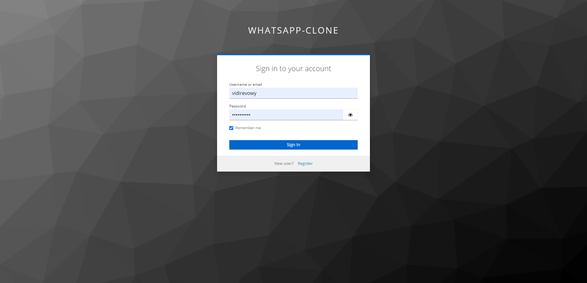
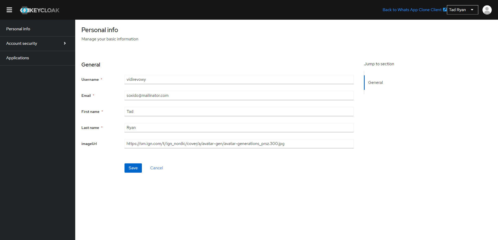
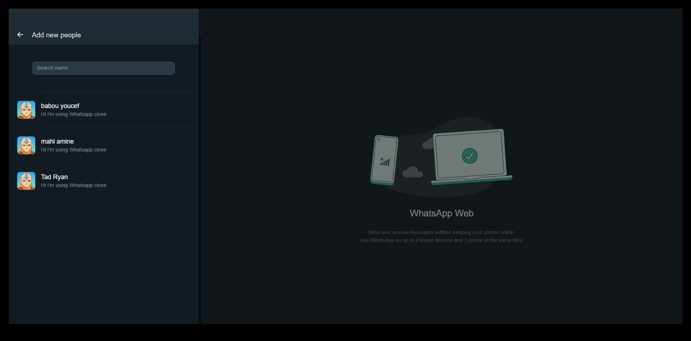
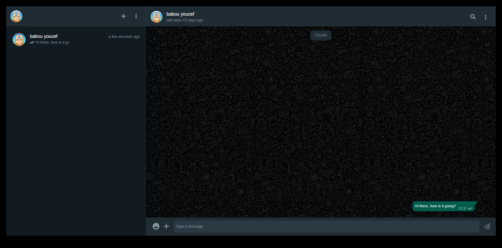
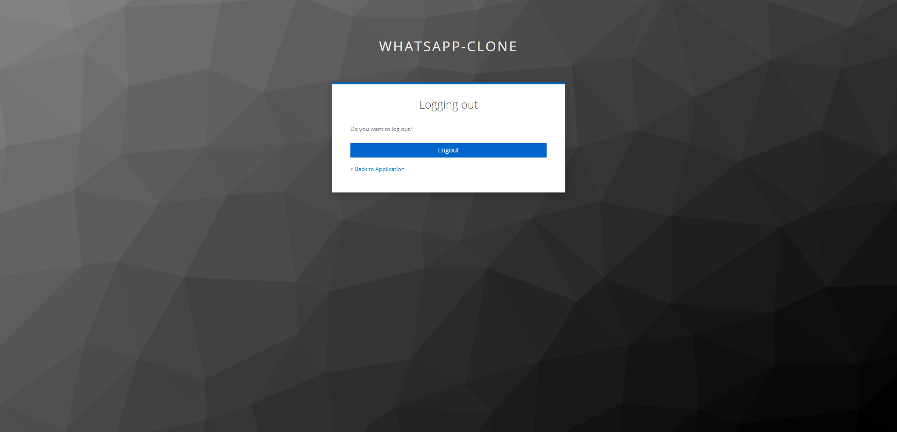

# Whatsapp Clone Application
##### Using  Spring Boot V3 & Angular V17


### About
WhatsApp Web Clone WhatsApp Web Clone is a real-time messaging app replica built with **Spring Boot**,  **Angular**,   **PosgreSQL**,  **Spring Security**, **JWT Token**, **Keykloak**, **Bootsrap** , and **Server-Sent Events ( SSE ) - SseEmitter**. It provides seamless user registration, login, and a real-time chat experience. The project includes both the frontend (built with Angular) and the backend (built with Spring Boot). If you’re interested, you can find the code on GitHub: WhatsApp Web Clone Repository.

Feel free to explore the repository and contribute if you’d like! 😊🚀

## Features

- Authentication and Authorization (Role management) with Keycloak (OAuth2)
- Conversations management.
- Realtime messaging Server-Sent Events ( SSE ) - SseEmitter.
- Hexagonal architecture.
- File sharing (images, videos, documents)

## What is Server-Sent Events ( SSE ) - SseEmitter?


SSE is a simple and efficient way to send real-time updates from a server to a client over an HTTP connection. It is a part of the HTML5 specification and is supported by all modern web browsers. SSE is based on a unidirectional data flow, where the server sends messages to the client, but the client cannot send messages back to the server.

SSE uses a text-based format known as “Server-Sent Events” to send data to the client. The data is sent as a series of events, each of which contains a message and an optional event type. The event type is used to distinguish between different types of messages and allows the client to handle them differently.

**Server-Sent Events (SSE)** : is a server push technology enabling a client to receive automatic updates from a server via an HTTP connection, and describes how servers can initiate data transmission towards clients once an initial client connection has been established

**WebSocket** : is a computer communications protocol, providing full-duplex communication channels over a single TCP connection

**Clint Polling** : Polling is a technique by which the client asking the server for new data regularly. We can do polling in two ways: Short Polling and Long Polling
[⬆ back to top](#job-portal-web-application)


## What is Hexagonal Architecture?

**Hexagonal Architecture**, also known as the **Ports and Adapters Architecture**,  is a powerful pattern used in software design (designing Spring Boot applications). Its primary goal is to create loosely coupled components within a system, making them easily exchangeable and testable. Let’s dive into the key concepts:

**1- Core Domain (Inside Part):**
- The core domain represents the heart of your application. It contains the essential business logic.
- In Hexagonal Architecture, the domain is isolated from external concerns (like databases, UI, and frameworks).
- Focus on solving business problems without worrying about technical details.

**2- Adapters (Outside Parts):**
- Adapters act as bridges between the core domain and external systems.
- **Ports:** Define contracts (interfaces) that specify how data flows in and out of the system (e.g., repository interfaces, service interfaces).
- **Adapters:** Implement these ports, connecting the domain to external components (e.g., database adapters, REST API controllers). 

**3- Benefits:**
- **Loose Coupling:** Components can be replaced without affecting the core domain.
- **Testability:** Isolate domain logic for easier unit testing.
- **Flexibility:** Adapt to changes in external systems seamlessly.

When implementing Hexagonal Architecture in Spring Boot, organize your project with clear separation between the core domain and adapters.

Remember, Hexagonal Architecture promotes decoupling from technology and frameworks, aiming for maintainable and modular code.

## Installation

Whatsapp Clone Application requires requires [Node.js](https://nodejs.org/) v20.13.1+ to run & JavaJdk V17+.

#### Server
```sh
cd whatsapp-clone-application-back
mvn clean install
## //On target folder ru this command
java -jar whatsapp-clone-application-back-0.0.1-SNAPSHOT
```

#### Docker
```sh
cd whatsapp-clone-application-back
docker compose build
docker compose up
```

[⬆ back to top](#whatsapp-clone-application)

## Screenshots
##### Home Page

[⬆ back to top](#job-portal-web-application)

##### Login Modal

[⬆ back to top](#job-portal-web-application)

##### Edit User Profile

[⬆ back to top](#job-portal-web-application)

##### Show List Of Users

[⬆ back to top](#job-portal-web-application)

##### Select User & Start Chating

[⬆ back to top](#job-portal-web-application)

##### Logout

[⬆ back to top](#job-portal-web-application)
## License

MIT

**Free Software, Hell Yeah!**
